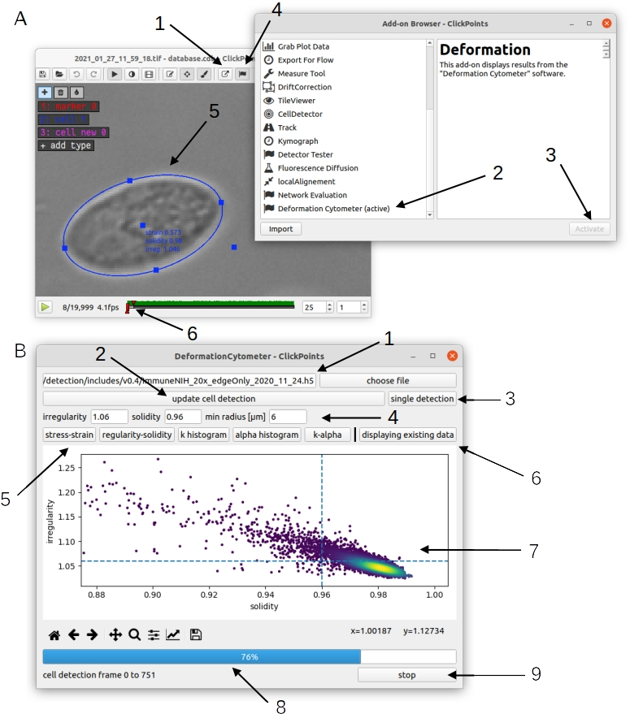
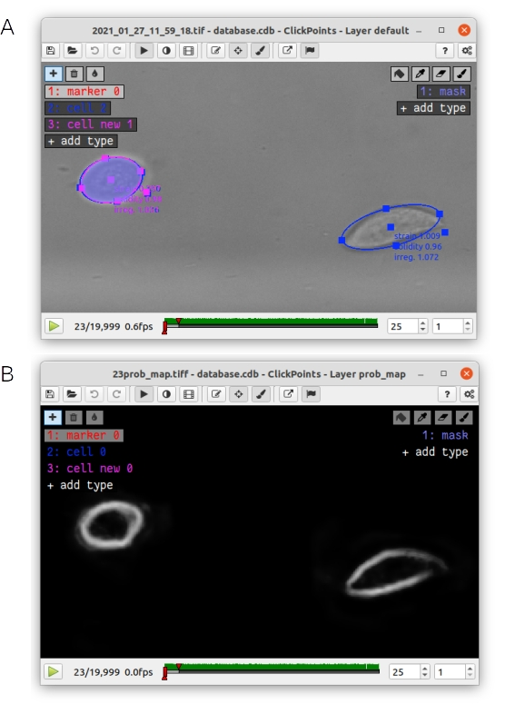
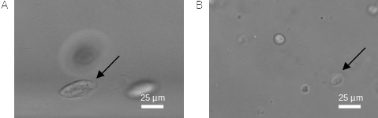
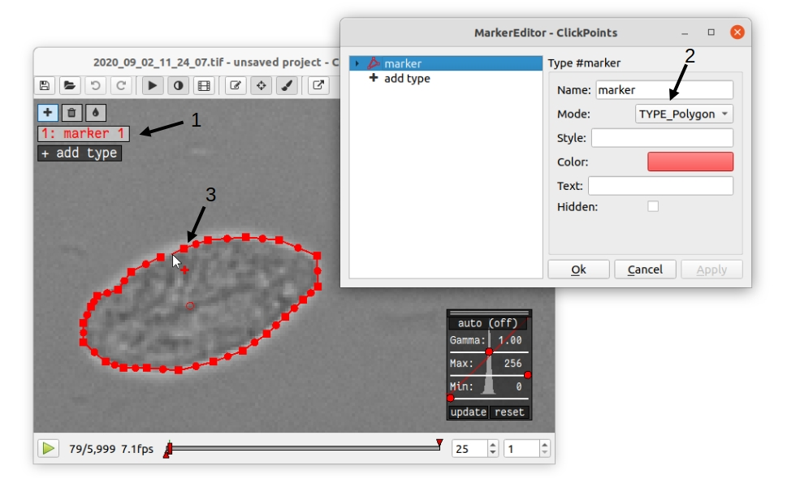
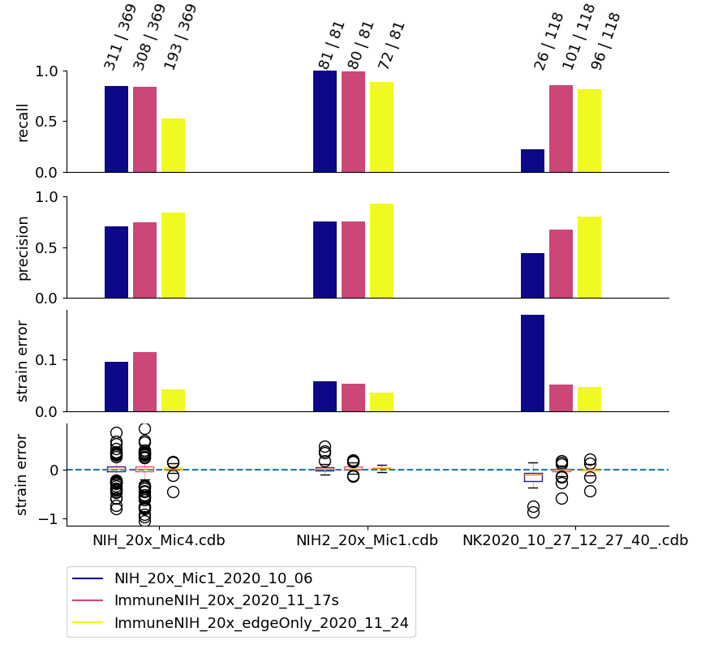

Adaptation of the neural network for other cell types and experimental conditions.
==================================================================================

The cell detection algorithm is based on a neural network that has been trained to detect fibroblasts (NIH-3T3),  monocytes (THP1), human primary NK-cells, and human primary neutrophils. The cell detection may fail if the analyzed cells significantly differ in their size or appearance, or if experimental or imaging conditions introduce significant changes to the cell contrast against the background. We advise to carefully examine the network performance for your particular experimental setup.

Visualizing the cell detection results
--------------------------------------

The shear flow deformation cytometer package allows the user to display the cell detection and easily evaluate the neural network performance using the image display and annotation tool ClickPoints. Installation and general usage instructions for ClickPoints can be found at https://clickpoints.readthedocs.io/en/latest/. Installing the shear flow deformation cytometer package automatically adds the "Deformation Cytometer" addon to ClickPoints.

The "Deformation Cytometer" addon has two main functions: It can display the raw image data and analyzed data (segmented cell shapes) that has been generated with the deformation cytometer analysis pipeline, and it can perform the image evaluation to compute cell stiffness, cell fluidity etc. on a selected range of frames of the video or multi-image tiff.

To activate the addon, open a video file with ClickPoints and activate the "Deformation Cytometer" addon from the Add-on Browser (:numref:`fig_cp_addon` A 1, 2, 3). The addon searches for the output files of the deformation cytometer pipeline in the same folder as the video file. If these files exist, the addon will automatically display the elliptical outline of the detected cells in the ClickPoints main window (:numref:`fig_cp_addon` A 5).  Additionally, the addon can display scatter plots of cell strain and cell stress, irregularity and solidity, cell stiffness (k), cell fluidity (𝛼), as well as histograms of the stiffness and fluidity (:numref:`fig_cp_addon` B 5). These values can be calculated for a subset of cells that fulfill user-adjustable irregularity and solidity criteria of the elliptical fit to the detected cell contour.

If the user clicks near or at a data point in a scatter plot, the clickpoints main window will automatically display the raw image, the neural network-segmented shape of the corresponding cell, and the elliptical fit to the outline of the cell. The user is advised to spot-check cells with high irregularity, low solidity or extreme positions in the stress-strain or stiffness-fluidity diagrams.

.. _fig_cp_addon:

    A: Activation of the “Deformation Cytometer” addon. 1) Open the ClickPoints addon browser. 2) Select the Deformation Cytometer addon. 3) Activate the addon. You will receive a notification that the addon has been successfully loaded after a few seconds. 4) Open the Deformation Cytometer addon window. 5) The addon loads existing output files and displays all detected cells in the ClickPoints main window as ellipses with marker type “cell”. 6) Sliders that can be used to set the range of frames for new analysis with the Deformation Cytometer addon. B: Deformation Cytometer addon window. 1) Select a neural network weight file. You can enter the full path to the weight file in the text box or select a file with a file browser by clicking the button “choose file”. 2) Start a new analysis using the specified network weights and filters. The analysis is performed on a range of frames specified with the sliders in the ClickPoints main window (A6). 3) Perform cell detection on the currently displayed frame. This also generates the network probability map and segmentation mask. 4) Set irregularity, solidity and cell size filters. 5) Select a plot to be displayed below. 6) Switch between display of existing data or newly generated data. 7) Matplotlib plot window. You can click near a data point in the scatter plots to view the corresponding cell in the ClickPoints main window. 8) Progressbar for the “update cell detection” function and the display of cells loaded from existing data. 9) Stop the process displayed in the progress bar.

The addon can also be used to evaluate the effect of inclusion or exclusion parameters (such as solidity and irregularity thresholds or range of cell sizes), or to validate the performance of the neural network. The user can select a custom or the default neural network weight file (:numref:`fig_cp_addon` B1), set the value for regularity, solidity and cell size filters (:numref:`fig_cp_addon` B4) and then perform a new analysis of selected frames of the video file. The range of frames to be analyzed can be set by moving the timeline sliders in the ClickPoints main window (:numref:`fig_cp_addon` A6). We suggest selecting at least 200 frames for each analysis run, as the algorithm requires the detection of multiple cells to accurately estimate the flow speed profile. Pressing the “update cell detection” button (:numref:`fig_cp_addon` B6) starts the analysis. Pressing the “stop” button (:numref:`fig_cp_addon` B9) terminates or interrupts the analysis. The analysis is completed when the progress bar reaches 100%. One can compare the results of the analysis (of the currently selected frames) with the data contained in the file “results.csv” that is located in the same folder as the image files (results.csv is an output file generated by the deformation cytometer pipeline). Pressing the “displaying existing data” (:numref:`fig_cp_addon` B6) button switches between display of new data and data from the results.csv file (scatter plots and histograms of k and 𝛼). Additionally, all cells detected in the new analysis are displayed in the ClickPoints main window as ellipses with the marker type “cells new” (:numref:`fig_cp_mask` A). It is also possible to display the neural network segmentation mask (:numref:`fig_cp_mask` A) and probability map (:numref:`fig_cp_mask` B) for individual frames by pressing the “single detection” button (:numref:`fig_cp_addon` B6) or pressing the keyboard shortcut “g”. The segmentation mask is displayed as an overlay in the ClickPoints main window. One can change the transparency by pressing “i” or “o”. The probability map is added as an additional image to the ClickPoints database and can be accessed from the ClickPoints main window by pressing the “page up” key; one can return to the original image with the “page down” key. Note that the segmentation mask is generated by first thresholding the probability map and then removing all objects without a fully closed boundary. For example,  the right hand cell in :numref:`fig_cp_mask` is completely removed as there is a large gap in the probability map at the cell edge. By contrast, filters for cell size, irregularity and solidity are not applied to the segmentation mask.

.. _fig_cp_mask:

    A: The elliptical fit of existing cells (blue) and cells that were detected in a new analysis from the Deformation Cytometer addon (pink) as well as the corresponding segmentation mask (blue area) are displayed in the ClickPoints main window. B: The probability map of the neural network is displayed as an additional image in the ClickPoints main window. It can be accessed by pressing the “page up” key. You can return to the original image with the “page down” key.

If the network prediction mask does not accurately cover/segment the cell area, it is advisable to re-train the neural network.

In our experience, the most efficient strategy is to train the network using transfer learning. Transfer learning means that the network starts from the existing network weights and improves these weights by training based on a small (no more than a few hundred cells), newly generated, ground truth dataset mixed with ground truth data that were used to train the existing network. We provide our ground truth data and weights with the latest release of the Deformation Cytometer package (https://github.com/fabrylab/Deformation_Cytometer/releases/latest).

In the following, we explain the software setup for network training on a GPU, the generation of ground truth data, the network training itself, and the evaluation of the training results.

Software setup for Neural Network Training
------------------------------------------

Installing the deformation cytometer package
~~~~~~~~~~~~~~~~~~~~~~~~~~~~~~~~~~~~~~~~~~~~

Prior to any further steps, we recommend installing the Anaconda python distribution (https://www.anaconda.com/products/individual), as it includes most python dependencies. Installation instructions can be found at https://docs.anaconda.com/anaconda/install/. For Windows systems, please add Anaconda to the Path variable by checking the corresponding box in step 8. This should be done automatically on a Linux system. Also note that the deformation cytometer software currently does not support python 3.9 or higher.

Next, download the deformation cytometer package from https://github.com/fabrylab/Deformation_Cytometer, open a terminal window, and navigate to the Deformation Cytometer folder. The folder must contain the setup.py file. Then execute the command “pip install -e .”.

Setting up graphic card support for neural network training and cell detection
~~~~~~~~~~~~~~~~~~~~~~~~~~~~~~~~~~~~~~~~~~~~~~~~~~~~~~~~~~~~~~~~~~~~~~~~~~~~~~
To support computation on a graphics card, install the CUDA and cuDNN library. The network training also requires the python library tensorflow.

Frequently, compatibility conflicts between tensorflow, cuda and cuDNN versions arise. For example, the latest tensorflow and cuda versions may not be compatible. Additionally, the graphics card may not support all cuda versions (see https://docs.nvidia.com/deploy/cuda-compatibility/index.html for compatability of cuda with your graphics card and https://www.tensorflow.org/install/source#gpu for cuda, cuDNN and tensorflow cross compatibility). Our system is set up with the following components: Cuda version 10.1, tensorflow version 2.3.0, cuDNN version 7.6.5 (for cuda 10.1). This setup should work on most GPUs and is therefore strongly recommended. Tensorflow version 2.3.0 is installed automatically with the deformation cytometer package. Up- or downgrading tensorflow (as low as version 2.0.0) to be compatible with other cuda versions is possible but also requires to up- or downgrade the package tensorflow-addons accordingly (see https://github.com/tensorflow/addons for version compatibility).

In the following, we provide step-by-step instructions on how to set up GPU supported neural network training for both Windows- and Linux-based operating systems:

Linux-based operating system
~~~~~~~~~~~~~~~~~~~~~~~~~~~~

For the setup of cuda and cuDNN on Linux (Ubuntu 18.04.05 LTS),  proceed as follows:

First, confirm that your GPU supports cuda, and perform the pre installation steps described at https://docs.nvidia.com/cuda/cuda-installation-guide-linux/index.html#pre-installation-actions.

Next, download and install the Nvidia CUDA Toolkit version 10.1. The Nvidia Tool Kit contains cuda 10.1 and additional drivers. Cuda 10.1 is not the latest cuda release and can only be found in the Nvidia archive at https://developer.nvidia.com/cuda-10.1-download-archive-base?target_os=Linux&target_arch=x86_64&target_distro=Ubuntu.

Finally, add the cuda directory to the PATH variable as described in https://docs.nvidia.com/cuda/cuda-installation-guide-linux/index.html#environment-setup. The other post-installation steps may not be necessary.

For neural network training, one also needs the cuDNN library, which can be downloaded from Nvidia's developer site (https://developer.nvidia.com/rdp/cudnn-archive) after registering an account with Nvidia. Download the cuDNN version 7.6.5 for cuda 10.1 for Linux file from https://developer.nvidia.com/rdp/cudnn-archive and install it with the “dpkg -i“ command.

Windows-based operating system
~~~~~~~~~~~~~~~~~~~~~~~~

General instructions for the cuda and cuDNN installation can be found at https://docs.nvidia.com/cuda/cuda-installation-guide-microsoft-windows/index.html and https://docs.nvidia.com/deeplearning/cudnn/install-guide/index.html#installwindows .

The cuda setup on Windows requires the C++ compiler in Microsoft Visual Studio. Download and install it from https://aka.ms/vs/16/release/vc_redist.x64.exe . The community version is sufficient, and no additional components need to be installed (one can ignore the suggestions offered by the installer).

Next, download the Nvidia CUDA Toolkit version 10.1 graphical installer from https://developer.nvidia.com/cuda-10.1-download-archive-base?target_os=Windows&target_arch=x86_64&target_version=10 . Make sure to select the “local” version. Open the installer and navigate through the installation dialog. The installation may trigger an automatic Windows update and restart, in which case you will have to repeat the cuda installation.

Download and unzip cuDNN version 7.6.5 for cuda 10.1 for Windows from https://developer.nvidia.com/rdp/cudnn-archive . This requires you to register an account at the Nvidia developers website. The cuDNN directory contains three subdirectories: \cuda\bin, \cuda\include, \cuda\lib\x64, containing “.dll”, “.h”, .lib“ files. cuDNN version 7.6.5 has only 1 file in each of the three subdirectories. These subdirectories correspond to directories of the cuda installation, which can be found for example in “C:\Program Files\NVIDIA GPU Computing Toolkit\CUDA\v10.1”. Copy the content of each cuDNN subdirectory to the corresponding cuda subdirectory. Finally, add all three subdirectories to the system path variable: Open the explorer, right click on “This PC”, select properties, Advanced system settings, Environmental Variables, select the “Path” variable in the System variables panel and add all three paths (e.g.: “C:\Program Files\NVIDIA GPU Computing Toolkit\CUDA\v10.1\bin”, “C:\Program Files\NVIDIA GPU Computing Toolkit\CUDA\v10.1\lib\x64” and “C:\Program Files\NVIDIA GPU Computing Toolkit\CUDA\v10.1\include”). The bin directory may already be contained in the path variable.

Additional requirements for Network Training
~~~~~~~~~~~~~~~~~~~~~~~~~~~~~~~~~~~~~~~~~~~~

One also needs to install the packages ClickPoints (for ground truth generation) and tensorboard (for visualization of the training process) with a standard package manager such as pip.

Ground truth data generation
----------------------------

The minimal required size of the new ground truth data depends on how far the new cell appearances (e.g. size, contrast) deviates from the data on which the existing neural network was trained.

As an example: Our first iteration of network weights was only able to detect fibroblasts (NIH-3T3 cells). We retrained this network in order to detect immune cells with 300 newly labeled images.  The retrained network was able to detect both immune and fibroblast cells despite major differences in cell shape and size (:numref:`fig_immun`).

.. _fig_immun:

    A: In-focus fibroblast cell (NIH-3T3 cell). B: In-focus immune cell

If the newly trained network is not able to correctly segment most of the cells that are in-focus, it is advised to increase the size of the ground truth dataset.

In addition to the ground truth data set used for network training, the user needs to generate a separate dataset that is used for the evaluation of the network. This dataset should contain at least 100 different cells and reflect the variability of the entire data set.

Ground truth data is most conveniently generated by outlining the cell edges in ClickPoints. Open a video or a directory with individual images by right clicking on the image and select “open with” ClickPoints.  Press F2 to display the  marker menu, right click on “marker” in the top left (:numref:`fig_cp_gt` 1), change the mode to TYPE_Polygon (:numref:`fig_cp_gt` 2). Our training script uses all polygons present in the ClickPoints database regardless of their name. Press ok and precisely outline all cells that are in-focus (:numref:`fig_cp_mask` 3). Make sure to click a fully closed circle. Save the database in regular intervals and after you are finished.

.. _fig_cp_gt:

    Ground Truth generation with ClickPoints.

Sometimes a cell is partially out of focus. In this case, there is a bright or dark halo around the cell edge, depending on whether the cell is located above or below the focus plane. Make sure to click the cell boundary at the cell edge and exclude this halo. Larger halos indicate cells that are out-of-focus; they should not be outlined. Note that with default settings, only images containing outlined cells are used for training. One can include empty images with the parameter “empty_images” in the training script as described below.

In most cases, the newly trained neural network should be able to efficiently detect also most of the cells that were previously detected using the old network weights, in which case we recommend mixing ground old truth data from with newly generated ground truth data. A ratio of 1:1 between new and old data  (which can be adjusted in the training script as described below) is a good starting point.  Our ground truth data can be downloaded from https://github.com/fabrylab/Deformation_Cytometer/releases/latest

Network Training
----------------

The network is trained with the “training.py” script, located in deformationcytometer/Neural_Network. The user needs to set several parameters in the script:  First, specify the location of the  ClickPoints databases that stores the ground truth (parameter “search_path”). The programm uses all .cdb files in the specified folder.  For each group of cdb files, one can specify how many images are used (parameters “n_images”) and whether images without cells should be included (parameters “empty_images”). One can add additional groups of ClickPoints files by expanding the list “cdb_file_list”.

Next, the user needs to provide the image dimensions (parameter “im_shape”). All images of the training dataset must have the same or inverse dimensions as specified in “im_shape”.

The user also needs to choose whether to continue training from an existing weight file or form randomly generated weights with the “weight_path” parameter. Provide the full path to a weightfile for continued training, or set “weight_path” to None to start with new randomly generated weights. Continuing the training from existing weights is almost always preferable. The standard network weights are attached to each release of the deformation cytometer software and can be downloaded from https://github.com/fabrylab/Deformation_Cytometer/releases/latest. The latest weight file is also downloaded automatically when performing cell detection for the first time, and are stored in the deformationcytometer/detection/includes directory.

Finally, the user needs to specify a path where training logs and output weight files are stored  (parameter “output_path”), and an additional name (parameter “log_name”) for both. The output weight file will also contain an automatically generated timestamp.

The trainig.py script contains a number of additional parameters that may improve the training speed and results. One can choose between reading the training data from the hard drive or from memory during training (parameter “train_from_disc”). Training from memory is faster, but large datasets may exceed the available memory space. When training from the hard drive, one can choose to extract new training data from the ClickPoints files specified earlier, or use existing training data (parameter “use_existing_data”). In any case, the user needs to specify a directory in which the training data are stored (parameter “dir_training_data”)

The user can further set some basic training properties: The number of epochs, learning-rate, batch size, size of the validation data set and whether to save only the best weight file, or update the weight file after each training epoch.

For our training, we typically down-weight all background pixels by a factor of 0.1, to compensate for the disproportionate number of background pixels. This weight can be set with the parameter “w_bg”. One can also provide custom weighting functions by specifying the function and its keyword arguments in a dictionary (parameter “weighting”). Weighting functions must have a two dimensional array, representing the ground truth mask of an image as their first argument, and return a two dimensional array that is used as a weight map during training.

We trained the network only on the cell edge, which we extract from the ground truth masks. One can also train on the whole cell area by setting the parameter “mask_function” to None. Alternatively, one can provide a custom function to manipulate the ground truth mask (parameter “mask_function”). This function needs to take a 2-dimensional integer array, representing the mask as its first argument and also return a 2-dimensional integer array. Note however that the current implementation of the cell detection algorithm is dependent on the segmentation of the cell edge. All segmented objects must form a closed loop with a hole or else are discarded.

Once all training parameters are set, the neural network training can be started by executing the “training.py” script.

Validation of the training progress and results
-----------------------------------------------

The performance of the newly trained network can be evaluated with the evalutate.py script located in deformationcytometer/Neural_Network.  In this script, one can specify a list of ClickPoints databases containing the ground truth (parameter “gt_list”), and a list of neural network weights (parameter “network_list”). For each database, the ground truth is compared to the result of the evaluation for each of the listed network weights. The script calculates the recall (fraction of all cells in the ground truth that are identified by the neural network), the precision (fraction of all predicted cells that are actually present in the ground truth), the mean error of the cell strain for all cells that could be matched from prediction to ground truth, and the distribution of these errors. All measures are calculated with and without applying regularity and solidity thresholds. The results are written to the files “results.csv” and “results_fltered.csv” in the folder specified with the “out_folder” parameter. The results are  also plotted to the files “network_evaluation.png” and “network_evaluation_filtered.png”. We recommend using the interactive plotting tool pylustrator  (https://pylustrator.readthedocs.io/en/latest/) for plotting. The pylustrator allows you to edit and resize labels and arrange the plot. In order to do so, set the “use_pylustrator” parameter to True.

:numref:`fig_train_eval` shows an example for the network evaluation. We compare 3 networks: NIH_20x_Mic_2020_10_06 was trained exclusively on fibroblasts (NIH-3T3 cells).   ImmuneNIH_20x_2020_11_17s and ImmuneNIH_20x_edgeOnly_2020_11_24 were additionally trained with a variety of immune cells. For ImmuneNIH_20x_edgeOnly_2020_11_24, we reduced the ground truth to only cover the cell edge and implemented filters to remove objects without a fully closed boundary. The latter is the current standard cell detection approach. All three networks were evaluated on three ground truth datasets: NIH_20x_Mic4.cdb and NIH_20x_Mic1.cdb contained NIH fibroblast but were imaged with a different microscope setup, and NK2020_10_27_12_27_40_ contained natural killer (NK) cells. Note that the ImmuneNIH_20x_edgeOnly_2020_11_24 network finds less cells (indicated by the smaller recall) but also has a significantly smaller error for the strain. We decided that the smaller error in the strain measurement was more important for two reasons: First, the network is forced to make an somewhat arbitrary decision on which cells are in focus and which are not. This uncertainty means that recall and precision are less important as a slightly out of focus cell that is otherwise segmented perfectly is acceptable. Second, the large number of cells in each experiment reduces the need for a high recall.

.. _fig_train_eval:

    Evaluation of neural networks:
    The numbers written on top of each column indicate how many ground truth cells have been identified and how many ground truth cells are present in total. Regularity and solidity filters influence both values.

Data analysis software
----------------------

Image processing
~~~~~~~~~~~~~~~~

The image files (multiframe tiffs) need to be analyzed to extract for each frame the cell shape, cell orientation (alignment angle), and the flow speed. These information in turn will be converted into the cell rheological data k and 𝛼. All procedures are contained in the routine “detect_cells_mutliprocess_pipe_batch.py. The user can select a directory from multiple experiments, and the program sequentially processes the data in all sub-directories. The user can select, apart from the main directory

- The trained weight files for the neural network
- Solidity and irregularity

As an output, the program generates a “evaluated.txt” file that contains the data for all detected cells, namely frame number, a,b, beta, speed, measured rotation speed, estimated rotation speed, G’, G”, k, 𝛼, solidity, irregularity.

Data analysis
~~~~~~~~~~~~~

Next, the “evaluated.csv” files from different experiments can now be combined and displayed using different programs that the user can assemble from powerful functions that take care of elementary routines such as loading the data, selecting the data based on certain criteria such as cell size, stress range etc. We provide a number of simple programs that may serve as examples on how to use these functions:

“figures_all-plots.py” displays the stress versus strain data, G’ and G” versus omega data, distribution of k and 𝛼, and measured and fitted velocity, in a single PDF file (in the same directory as the image data).

“Dose_response.py”

“Time_dependency.py”

“Figure_paircontrol.py” compares two data sets, one control and one with a drug treatment for example, performs a histogram matching, and plots the ratio of stiffness between drug treatment and control as a function of drug concentration.
